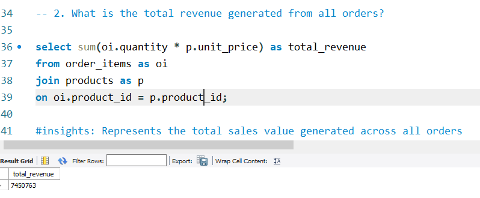
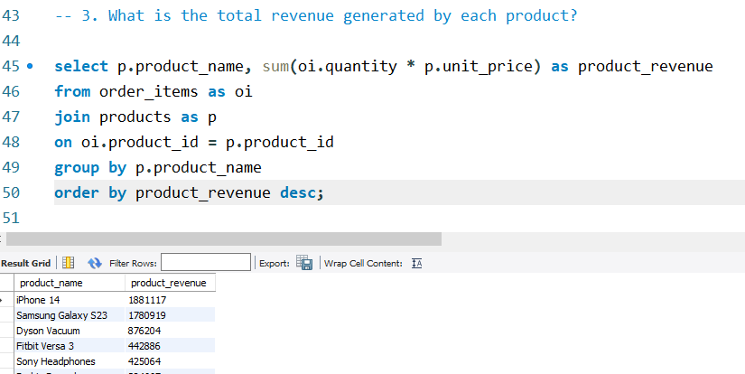
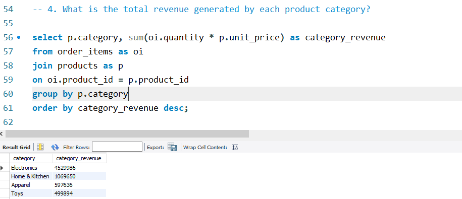
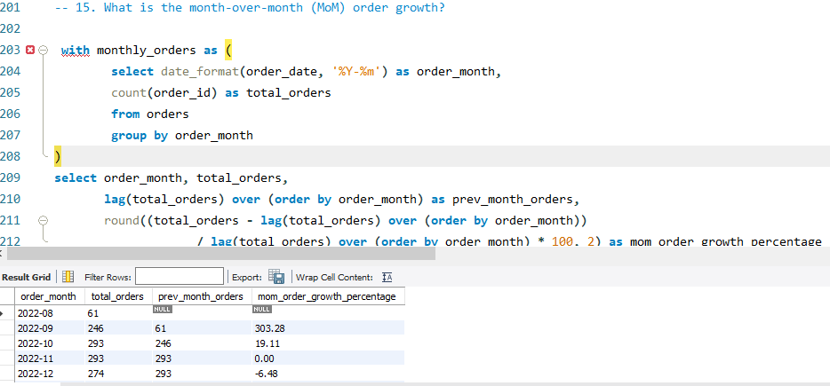

# 🛒 E-commerce Business Analysis using SQL


---

## 📌 Project Overview
This project performs end-to-end E-commerce sales analysis using SQL on transactional data.

The objective is to extract actionable business insights by analyzing customer behavior, product performance, and time-based trends — similar to real-world Data Analyst workflows.

---

## 🎯 Business Objectives
- Measure overall business performance (Revenue, Orders, AOV)
- Identify high-value and repeat customers
- Analyze product and category contribution
- Track monthly trends in sales and demand
- Calculate Month-over-Month (MoM) growth
- Generate insights for data-driven decision making

---

## 🧱 Data Model
The dataset consists of 4 relational tables:

- **Customers** → Customer details  
- **Orders** → Order-level transactions  
- **Order_Items** → Line-level purchase data  
- **Products** → Product & category details  

### 🔗 Schema Relationship
Customers → Orders → Order_Items ← Products  

- One customer → many orders  
- One order → many products  
- One product → multiple transactions  

This structure follows a **Star Schema**, widely used in analytics systems.

---

## 🔍 Data Exploration
Initial analysis included:

- Row count validation  
- Table relationship understanding  
- Primary & foreign key checks  
- Date range validation  
- Null/missing value checks  
- Category & product distribution  

```sql
SELECT COUNT(*) FROM orders;

SELECT DISTINCT category FROM products;

SELECT MIN(order_date), MAX(order_date) FROM orders;
```

## 🧹 Data Cleaning

Performed basic data validation:

- Converted date columns into proper format
- Verified numeric fields (price, cost, quantity)
- Ensured correct joins across tables
- Checked for duplicates and null values

Dataset was largely clean, requiring minimal preprocessing.

## 🛠️ SQL Techniques Used

-Joins (INNER JOIN, LEFT JOIN)
-Aggregations (SUM, COUNT, AVG)
- GROUP BY & ORDER BY
- Subqueries & CTEs
- Window Functions:
- RANK() → Product ranking
- LAG() → MoM growth
- Running Total calculations
- Date Functions for time-series analysis

## 📊 Key Metrics (KPIs)
Metric	Value
- Total Orders	10,000
- Total Revenue	₹7,450,763
- Average Order Value (AOV)	₹745

## 📈 Business Insights

🔹 Revenue & Product Analysis

- Electronics category generated highest revenue (~₹4.5M)
- Top products (iPhone 14 & Samsung Galaxy S23) contributed major share
- Revenue is concentrated among few high-performing products (Pareto effect)

🔹 Customer Behavior

- High-value customers significantly impact total revenue
- Repeat customers show stronger engagement and higher contribution

🔹 Time-Based Trends

- Revenue increased by ~173% (Aug → Sep) and ~40% (Sep → Oct)
- Peak observed in October (~₹226K)
- Orders grew by ~303%, indicating rapid growth phase

🔹 Advanced Analysis (MoM Growth)

- Identified growth spikes and decline phases using window functions
- Helps track business performance trends over time
- Useful for forecasting and strategic planning

## 📊 Analytical Reports Generated

- Sales Summary
- Customer Ranking
- Category Performance
- Monthly Revenue Trend
- Running Revenue Total
- Month-over-Month Growth

## 🧠 Sample SQL Query (MoM Growth)
```sql
WITH monthly_revenue AS (
SELECT DATE_FORMAT(o.order_date, '%Y-%m') AS order_month,
SUM(oi.quantity * p.unit_price) AS revenue
FROM orders o
JOIN order_items oi ON o.order_id = oi.order_id
JOIN products p ON oi.product_id = p.product_id
GROUP BY order_month
)
SELECT order_month,
revenue,
LAG(revenue) OVER (ORDER BY order_month) AS prev_month_revenue,
((revenue - LAG(revenue) OVER (ORDER BY order_month)) /
LAG(revenue) OVER (ORDER BY order_month)) * 100 AS mom_growth
FROM monthly_revenue;
```

📸 Project Screenshots

## 📸 Project Screenshots

### Total Revenue Analysis


### Top Products


### Category Revenue


### MoM Order Growth Analysis


---

## 💡 Key Learnings

- Applied SQL to solve real-world business problems
- Gained hands-on experience with window functions
- Improved analytical thinking and KPI design
- Learned how to convert raw data into business insights
 
## ▶️ How to Run
- Import CSV files into MySQL/PostgreSQL
- Create tables and load data
- Execute SQL script (ecommerce_sql_queries.sql)
- Run queries to reproduce insights
  
## 🎯 Conclusion

This project demonstrates how SQL can be used to transform raw transactional data into actionable insights.

It reflects real-world data analytics workflows and showcases strong skills in SQL, data exploration, and business analysis. 

## 👨‍💻 Author

#### Saurabh Verma
#### Data Analytics | SQL | Python | Power BI
